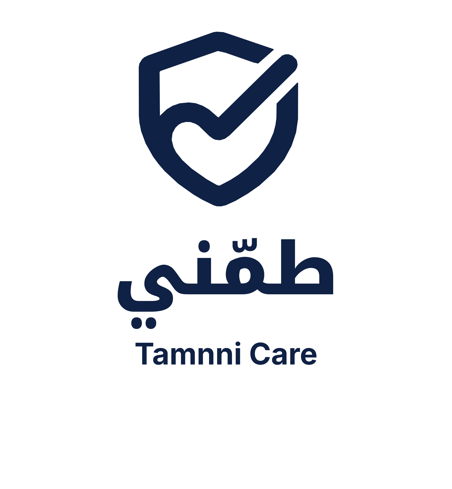

<p align="center">
  
</p>

# Tamnni Care

[](https://github.com/mhmdwaelanwr/TamnniCare/actions/workflows/android-ci.yml)
[](https://github.com/mhmdwaelanwr/TamnniCare/actions/workflows/repository-health.yml)

Tamnni Care (طمّني) is a Kotlin Multiplatform mobile prototype for elderly reassurance and family care coordination. It focuses on simple daily check-ins, medication reminders, missed-check-in alerts, and a calm senior-friendly experience shared across Android and iOS.

## Project Status

**Active prototype / MVP foundation.** The repository currently contains the shared Compose Multiplatform UI, Android and iOS entry points, navigation, onboarding and role flows, senior/caregiver home experiences, medication and alert screens, local UI state, design-system assets, and common tests.

This project is not a medical device, emergency service, or substitute for professional medical advice or emergency care. Prototype help and alert flows should not be treated as live emergency integrations unless explicitly connected to a production service.

## MVP Goals

- One-tap daily reassurance for senior users.
- Medication reminders and confirmation flows.
- Missed check-in alerts for caregivers/family.
- A simple help flow with large, accessible UI.
- Shared product experience across Android and iOS.

The V1 product scope intentionally excludes live location tracking, video calls, wearable/device sync, doctor consultations, advanced AI, and payments.

## Tech Stack

- Kotlin Multiplatform
- Compose Multiplatform
- Material 3
- Android + iOS targets
- Navigation Compose
- Multiplatform Settings
- kotlinx-datetime
- Gradle version catalogs

## Project Structure

```text
TamnniCare/
├── composeApp/
│   └── src/
│       ├── commonMain/      # Shared UI, navigation, state and resources
│       ├── commonTest/      # Shared tests
│       ├── androidMain/     # Android entry point/platform code
│       └── iosMain/         # iOS bridge/platform code
├── iosApp/                  # Native iOS application shell
├── docs/                    # PRD, architecture, flows and design system
├── assets/branding/         # Tamnni Care branding assets
├── reference/               # Product notes/prompts; visual references excluded
└── gradle/                  # Version catalog and wrapper configuration
```

## Build Android

Requirements: JDK 17 and an Android SDK compatible with compile/target SDK 35.

```bash
./gradlew :composeApp:assembleDebug
```

On Windows:

```powershell
.\gradlew.bat :composeApp:assembleDebug
```

## Run iOS

Open `iosApp/iosApp.xcodeproj` in Xcode on macOS and run the iOS application target. The shared Kotlin framework is configured from the `composeApp` module.

## Tests

Shared state and policy tests live under `composeApp/src/commonTest`.

```bash
./gradlew :composeApp:testDebugUnitTest
```

CI performs an Android compile/test validation on pushes and pull requests to `main`, while the repository-health workflow checks for generated/private files and common committed-secret patterns.

## Documentation

- [Product Requirements](docs/PRD.md)
- [Architecture](docs/ARCHITECTURE.md)
- [User Flows](docs/USER_FLOWS.md)
- [KMP Folder Structure](docs/KMP_FOLDER_STRUCTURE.md)
- [Design Tokens](docs/design_system/DESIGN_TOKENS.md)

## Public Repository Hygiene

Generated Gradle/Kotlin output, IDE metadata, signing files, local environment files, service configuration files, and private/third-party visual reference material are intentionally excluded from version control.

## License

Original Tamnni Care project-specific source code and original project materials are copyright © 2026 Mohamed Anwar. All rights reserved unless explicitly stated otherwise. Third-party dependencies and assets remain governed by their respective licenses.
